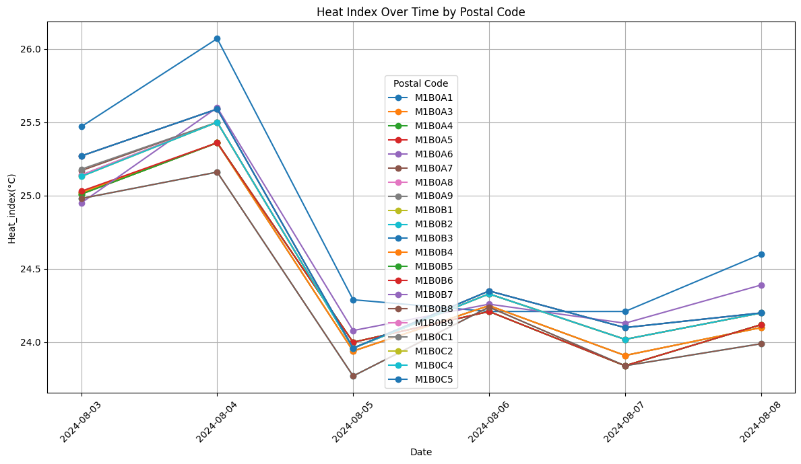

# WeatherForecast: Past-Present-Future
Data ingestion pipelines for optimizing logistics through weather data integration, featuring API-driven weather insights stored in MS SQL Server.

## Project Overview
The goal of this project is to create a comprehensive system that ingests, processes, and stores weather data, including Current Weather, Weather Forecasts, and Historical Weather Data, using APIs from third-party providers.

## APIs Used
- **Open Weather API**: Used for retrieving Current Weather and Weather Forecasts.
- **Open Meteo API**: Used for collecting Historical Weather Data.

## Data Pipelines
Three data ingestion pipelines were designed to handle different types of weather data:
1. **Historical Weather Data Pipeline**: 
   - Ingests historical weather data from the Open Meteo API.
   - Processes and stores the data in the `Historical_Weather_Data` table.

2. **Current Weather Data Pipeline**:
   - Retrieves current weather conditions from the Open Weather API.
   - Processes and stores the data in the `Current_Weather_Data` table.

3. **Weather Forecast Data Pipeline**:
   - Pulls weather forecasts from the Open Weather API.
   - Processes and stores the data in the `Forecast_Weather_Data` table.

Each pipeline is designed to be scheduled and run daily, ensuring that the weather data remains up-to-date. The pipelines handle data ingestion, cleaning, and feature engineering before storing the data in the appropriate tables.

## Data Collection and Processing
- **Data Collection**: 
  - The data for Current Weather and Weather Forecasts is pulled daily and then replaced.
  - Historical Weather Data is collected using the Open Meteo API.
  
- **Data Processing**: 
  - A Python script processes the collected data to create appropriate features.
  - The processed data is then pushed to a Microsoft SQL Server database.
  - Data is categorized and stored in tables for Current Weather (`Current_Weather_Data`), Weather Forecasts (`Forecast_Weather_Data`), and Historical Data (`Historical_Weather_Data`).

## Data Ingestion and Automation
- **Python Script**:
  - The Python script is designed to run autonomously on a schedule, updating the SQL database at 6am daily.
  - Location data such as postal code, latitude, and longitude is ingested from a Microsoft SQL Server table named `postal_codes` under the `uploads` schema.
  - The location data is used as input for the Open Weather API to pull weather data for the specified locations.

## Database Schema
- **Uploads Schema**: 
  - uNDER "Uploads" schema, three tables were created: `Current_Weather_Data`, `Forecast_Weather_Data`, and `Historical_Weather_Data`.
  - The schema is designed to be flexible and scalable, allowing easy updates and maintenance.

## Feature Engineering:
- The feature `temp_diff(°C)` was engineered to calculate the difference between the maximum and minimum temperatures for the day, highlighting temperature variation during that period.
- Weather conditions were classified into three categories: Clear, Cloudy, or Rainy, with `Unknown` handling any exceptions.
-Focused on key temperature data points (maximum, minimum, and mean) for consistency across all three tables.
-Calculated and stored the mean of these temperature data points to provide more valuable insights.

- **City and Population Data**:
  - The Open Weather API responses include city name and population, which are programmatically added for each postal code, latitude, and longitude.
  
- **Visualizations**:
  - Temperature data per postal code enabled the creation of visualizations to reveal trends over time, which can inform logistical planning or time-sensitive meteorological research.
   

## Conclusion
This project successfully integrates weather data collection and processing using APIs, providing valuable insights for various applications. The challenges encountered were addressed to ensure the consistency and usefulness of the weather data.

## Future Work
- Expand the feature set to include additional weather metrics.
- Improve the automation process to handle more complex data ingestion and processing scenarios.
- Explore integration with additional weather data sources to enhance the richness of the dataset.

## How to Use
1. Clone the repository.
2. Set up the Microsoft SQL Server database and update the connection settings in the Python script.
3. Run the Python script to start collecting and processing weather data.
4. Schedule the script using a task scheduler (e.g., cron) for daily updates.

## License
This project is licensed under the MIT License - see the [LICENSE](LICENSE) file for details.

## Copyrights

